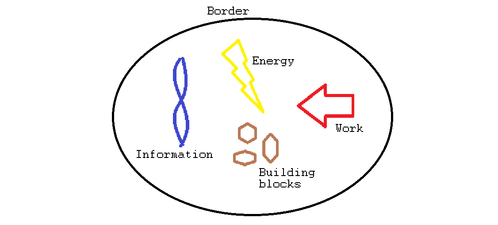

What is life? Since ever, humans have wondered why we are here, and entire civilizations have been built around attempted answers to this question. In the past we tried to answer this question mainly as "*Why* are we here?" and tried to understand the world from that point of view. That didn'treally lead anywhere besides the depressing and/or liberating "For nothing, actually". A much better road to the answer is "*How* are we here?".

And to answer that question we have biology, especially molecular biology. In this post, I want to present a brief and compact concept of what we gathered over the last centuries about how life works, roughly speaking. Like every model, it could me made even more simple to be more general, or it can be made more complex to be more accurate, and I tried to stay on the simple side.

Life needs a **defined space** withing borders because it is a state of complex order in a hostile environment. Inside, molecules can interact fairly undisturbed and in a controlled manner, while the vast outside is chaos and cannot be controlled by a cell. These borders are cell walls and cell membranes.

Life needs **building blocks** (molecules of all types), and it needs an incredible variety of them. They are too complex to exist "by default" in our universe, thus they must be created. Doing _anything_ for a cell usually means building specific molecules and using their specific impact on other molecules. The effect of that specific molecule can be anything from being building material over activating other molecules to "reading" information.

Life needs **information** as a blueprint for the molecules that must be built. Those molecules are not created by chance, but rather with a rigorous plan. This information is stored in the DNA and "read" by specific molecules. 

Life needs **energy**. Who doesn't? Without energy, nothing can be done. Simply maintaining order already needs constant effort, otherwise things tend to become chaotic. Energy is either prduced trough photosynthesis or by "eating" energy-rich molecules like sugar.

Life needs **work** - or in other words: something, that performs necessary tasks. Even though chemical reactions happen all the time, you need to put in some extra effort to get the reactions you really want and something needs to control this. In the case of life the "workers" are special molecules called enzymes.

With these five concepts established, let's go into a little more detail.

Information is stored in the DNA and read by enzymes in order to duplicate the DNA or to produce proteins with the information they get. This is a step-by-step process: each bit of information is a special chemical structure that is "read" and which causes the enzyme to do a certain thing. This is the reading process. At the end we either have a second string of DNA or a protein.

Proteins are huge molecules, consisting of thousands or ten thousands of atoms. Water, in comparison, consists of three atoms. Proteins have two main functions. They either build a structure, a tunnel for water to flow in and out, for example. Or they can *do* things like "reading" the information of the DNA, then they are called enzymes. Enzymes are like micro-robots with a very specific task, they are the workers who control most of the chemical reactions happening in a cell.

Enzymes do about everything that is relevant in a cell. Without them the cell could not use food, reproduce, fight off attacking cells or react to a sudden increase of temperature. They are responsible for building everything, including other proteins with the information of the DNA, but also the cell wall for example. They take a certain molecule and attach it to the cell wall to make it stronger. Where does the molecule come from? A bunch of other enzymes have made it. And how? By using building blocks, provided by other classes of enzymes, and of course with energy.

Energy is key, without it nothing would work, no car moves, the internet is dead and so would be our cells. Energy can be gained from chemical reactions. In principle, it is the same as burning wood, but instead of the quadrillions of reactions which make up a fire, the cells perform only a few, which are enough for her to live. The cell also is able to store a good part of the energy in a more convenient form - like humans use the energy from power plants and store it in a battery to power a cell phone, which works perfectly fine, while the phone would be destroyed by the heat of the power plant. It is all about clever systems and proper management of resources, for humans and even more so for life itself. All of this is done by enzymes, of course.

Proper fascinating how that works. But biology is still far from understanding the details, and while the devil lies there, so too the angles.

We have a long journey ahead of us. Let's get to work. 