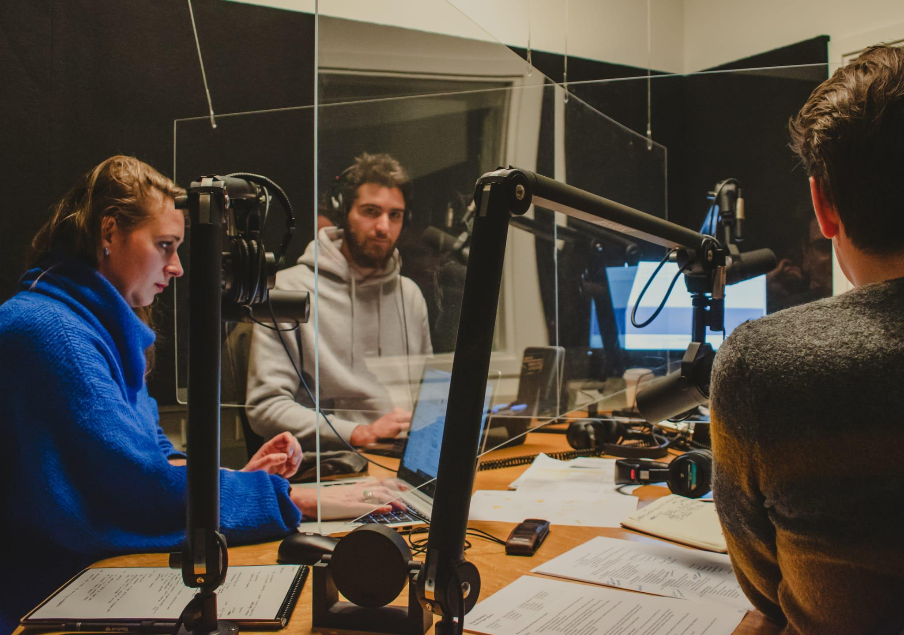

**Open Science means proper science.**

It is a deep conviction of mine that we as academics have the responsibility to be effective in our research and transparent in our communication. Open science not concerns the social, political, financial, and legal environment in which scientists work and asks all the right questions (and has some very good answers, in my opinion). A major interest of mine are research transparancy and open data, as well as how recognition and (financial) rewards for scientific work are structured.

**Doing my part (so far ...)**

For half a year, I worked as student assistant at Utrecht University's **Road to Open Science** podcast (on [Spotify](https://open.spotify.com/show/6GvtmgOjs4lc76Aiz9RO46) or [Soundcloud](https://soundcloud.com/utrechtyoungacademy)) that invites Open Science enthusiasts who contribute to the movement and explors a wide range of Open Science themes. I contributed especially to the episode ["Faces of Open Science"](https://open.spotify.com/episode/5s435lLwFcIPMjv6IxZugB), where two philosophers of science tell us about the "archetypes" within the Open Science movement that they found in their research.

I also was a co-founder of **SIOS Utrecht**, the (now defunct) [Student Initiative for Open Science](https://openscience-utrecht.com/sios-utrecht-1/). We were supported by the Open Science Community Utrecht (OSCU) and hoped to create a small community of like-minded students, but alas, we were not able to secure a succession before the founding members departed into different directions. Students are awfully busy and Open Science yet too abstract, it seems. Remaining public legacy of SIOS is a [talk about preregistration](https://www.youtube.com/watch?v=_AHprT0mosw), but we learned a clear lesson about the difficulty of creating even a tiny a social movement and respect for those people and movements that achieve their goals.

But of course, the Open Science movement in general is alive and well!

**Doing your part**

- The first rule of Open Science is: Do talk about Open Science.
- The second rule of Open Science is: Do talk about Open Science.
- The third rule of Open Science is: There is always room for improvement.

We need everybody! Join your local Open Science Community, reach out to other communities if there is none at your institute. Talk to people whenever you have doubts about the quality or transparency of research. An of course, listen to the R2OS podcast on Spotify.

Let's make science better.